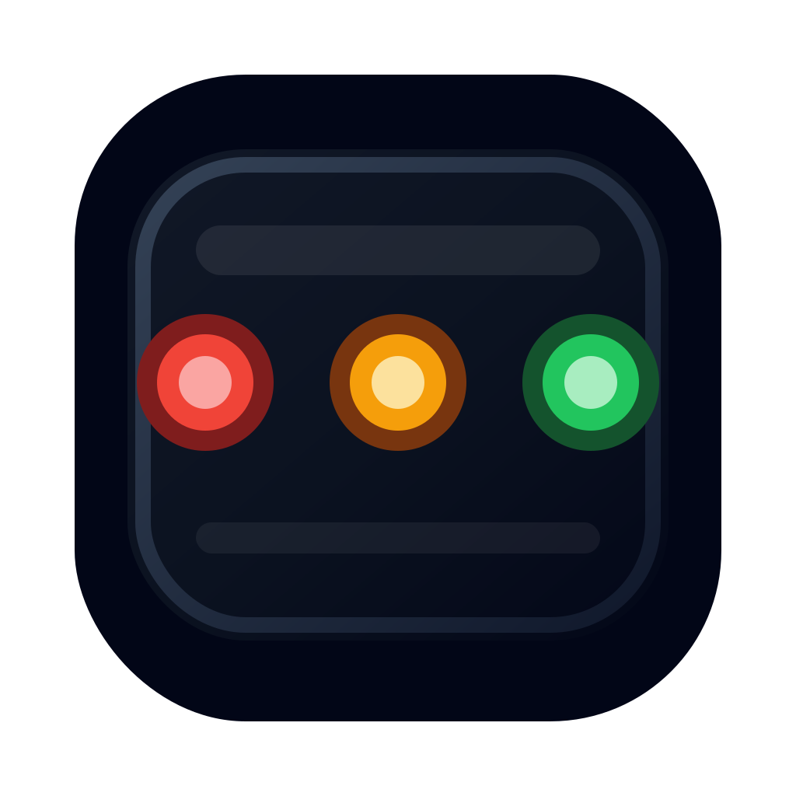

# AI Agents Leader



**看灯就知道 AI 是否还活着。**

本地运行的 AI Runtime Signal System。用红黄绿三灯，在一眼之间告诉你多个 AI Agent 是在等待、执行、完成，还是已经出错。

不是 AI IDE，不是 Dashboard，不是聊天客户端。它就是你桌面上的状态信号灯。

---

## 快速开始

### 仓库内运行（推荐）

```bash
git clone <repo-url>
cd AI_Agents_Leader
pnpm install
pnpm dev
```

默认推荐从 `pnpm dev` 开始，它会以 Web 模式启动并优先连接本地真实 agent。

### CLI 入口（发布场景）

```bash
npx ai-agents-leader
```

或全局安装：

```bash
npm install -g ai-agents-leader
aal
```

npm 页面：<https://www.npmjs.com/package/ai-agents-leader>

发布安装只需要 Node.js。若要使用 `aal start` 桌面模式，还需要本机可用的 Rust / Cargo；不需要 pnpm，也不需要仓库源码。

`aal check` 会检查当前环境是否具备桌面模式所需条件。`aal start` 在首次运行时会把桌面模板复制到 `~/.ai-agents-leader/desktop/<version>/overlay`，并在本地执行一次 Tauri release 构建；后续会直接复用缓存产物启动。

### 命令选项

```bash
aal           # 启动桌面 UI 模式
aal dev       # 启动 Web 模式
aal dev:mock  # 启动 Web Mock 模式
aal start     # 启动桌面 UI 模式
aal start:mock # 启动桌面 Mock 模式
aal runtime   # 仅启动 Runtime
aal runtime:mock # 仅启动 Mock Runtime
aal clean     # 清理残留进程
aal check     # 检查系统状态
aal fixit     # 自动修复常见启动问题
```

---

## 支持的 AI Agent

| Agent              | 检测方式                | 多会话 |
| ------------------ | ----------------------- | ------ |
| Claude Code        | Hooks 插件 + JSONL 文件 | ✅      |
| Cursor             | 进程检测 + 文件监听     | ❌      |
| Codex (OpenAI)     | 进程检测 + 会话文件     | ❌      |
| OpenCode           | 进程检测 + 配置文件     | ❌      |
| Cline (VS Code)    | VS Code 进程 + 扩展状态 | ❌      |
| Roo Code (VS Code) | VS Code 进程 + 扩展状态 | ❌      |
| 自定义 / 第三方    | HTTP API 推送           | ✅      |

无需手动配置，启动后自动检测正在运行的 Agent。

---

## 信号灯含义

每个 Agent 有 3 个灯，通过颜色和动画告诉你状态：

| 灯效                | 状态     | 含义              | 你需要做     |
| ------------------- | -------- | ----------------- | ------------ |
| 🟡🟣 黄紫交替流动     | 思考中   | AI 在分析、规划   | 等就行       |
| 🔵🟣🔵 蓝紫青交替流动  | 执行中   | AI 在干活         | 等就行       |
| 🟡 黄灯低闪          | 等待确认 | AI 需要你批准操作 | 去点确认     |
| 🟢 绿灯闪 3 次后常亮 | 已完成   | 任务完成了        | 去看结果     |
| 🔴 红灯高频闪        | 出错了   | 出错或中断        | **立即关注** |
| 🟡 黄灯快闪          | 可能卡住 | 长时间无活动      | 检查一下     |
| ⚫ 灰灯微弱呼吸      | 空闲     | 没有任务          | 无           |

---

## 界面预览

```text
╭────────────────────╮
│ – ▲ ✕              │   ← 窗口控制按钮
│ ▾ Claude · admin   │   ← 点击展开详情
│                    │
│   ● ● ●        ✦   │   ← 3 个信号灯 + Nudge 按钮
│                    │
╰────────────────────╯
```

展开后显示：

- **Status** — 当前状态
- **Dir** — 工作目录
- **Time** — 运行时间 / 最后活动时间

---

## 桌面浮窗模式

安装 Rust 后可用桌面浮窗（透明、无边框、始终置顶）。

```bash
# 启动桌面模式
pnpm start

# 或 CLI
aal start
```

仓库内执行 `pnpm start` 时会直接使用源码工程。发布安装后执行 `aal start` 时，会使用 npm 包内自带的 overlay 模板，在用户目录本地构建并缓存桌面端。

首次启动会编译 Rust（约 2-3 分钟），之后秒开。桌面端只负责 UI，若 runtime 未运行，会自动拉起 runtime-only 模式。

---

## 第三方 Agent 接入

任何支持 HTTP 的 Agent 都能接入，发送 POST 请求即可：

```bash
curl -X POST http://127.0.0.1:9989/api/state \
  -H "Content-Type: application/json" \
  -d '{
    "agentId": "my-agent",
    "agentName": "My Agent",
    "status": "running",
    "meta": { "source": "custom" }
  }'
```

可用状态：`idle`、`thinking`、`running`、`completed`、`error`、`waiting_input`、`stalled`

---

## Claude Code Hooks

首次启动自动安装 Hooks 插件到 `~/.claude/plugins/ai-agents-leader/`。

Hooks 会在以下时机实时推送状态：

- 用户提交 prompt → 思考中
- Claude 请求执行工具 → 等待确认
- 工具执行中 → 运行中
- Claude 完成回复 → 已完成

**需要重启 Claude Code 才能激活插件。**

---

## 端口

| 服务       | 端口 |
| ---------- | ---- |
| WebSocket  | 9988 |
| HTTP API   | 9989 |
| Overlay UI | 1666 |

端口冲突时会自动清理残留进程。

---

## 开发

```bash
# Web 模式（真实本地 agent）
pnpm dev

# Web Mock 模式
pnpm dev:mock

# 桌面 UI 模式（真实本地 agent）
pnpm start

# 桌面 Mock 模式
pnpm start:mock

# 仅启动 Runtime
pnpm runtime

# 仅启动 Mock Runtime
pnpm runtime:mock

# 停止 / 检查 / 自动修复
pnpm clean
pnpm check
pnpm fixit

# 清理所有 node_modules
pnpm clean:node

# 代码检查 / 构建
pnpm lint
pnpm build
```

目录说明见 [docs/dir.md](docs/dir.md)，详细开发文档见 [docs/development.md](docs/development.md)，AI 交接文档见 [docs/ai-dev.md](docs/ai-dev.md)。

版本号、tag 和 release note 草稿见 [VERSION.md](VERSION.md)。

---

## 开源与贡献

项目正在进行开源准备。

- 开源方向与协作边界见 [OPEN_SOURCE.md](OPEN_SOURCE.md)
- 提交 Issue 和 Pull Request 的方式见 [CONTRIBUTING.md](CONTRIBUTING.md)
- 社区协作行为准则见 [CODE_OF_CONDUCT.md](CODE_OF_CONDUCT.md)
- 安全问题反馈方式见 [SECURITY.md](SECURITY.md)
- 隐私与数据边界说明见 [PRIVACY.md](PRIVACY.md)

---

## 许可证

MIT，详见 [LICENSE](LICENSE)。
